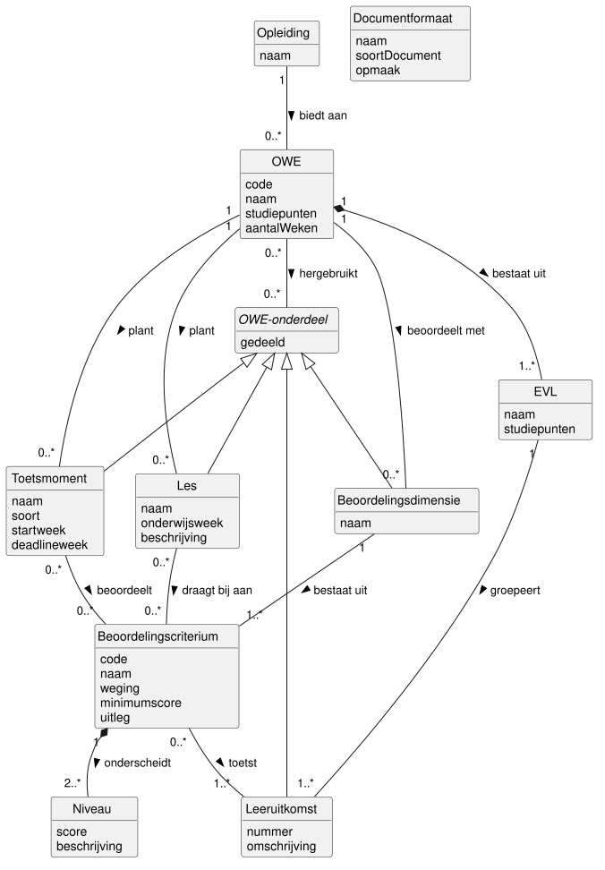

# Domeinmodel ICDE

Dit document toont het domeinmodel van ICDE en onderbouwt het.
Het bouwt voort op [systeemgrenzen.md](systeemgrenzen.md), [use-cases.md](use-cases.md) en
[use-case-beschrijvingen.md](use-case-beschrijvingen.md).
Bronnen: de ICDE-casus in [README.md](../README.md), de Modulebeschrijving van de toets Casus, de
lesplanning en de rubric van OOSE-DT als voorbeeld van echte OWE-gegevens.

## Domeinmodel

De bron is [diagrams/domeinmodel.puml](diagrams/domeinmodel.puml).

## Aanpak

We volgen de cursus (Thema 3 Domain Modeling en de richtlijnen bij Mastermind):

- Het model toont de werkelijkheid van het onderwijsontwerp, geen software.
- Het bevat concepten, attributen, associaties en multipliciteiten.
- Het bevat geen operaties, datatypes, visibility of navigatie.
  Navigatie is een ontwerpbeslissing.
- Elke associatie heeft een naam, een werkwoordsvorm.
  Het driehoekje geeft de leesrichting aan.
- Generalisatie gebruiken we waar dat zinvol is.
- We gebruiken de namen van de opdrachtgever ("strategie van de kaartenmaker").

We vonden de concepten met Noun Phrase Identification (NPI) volgens het stappenplan van de
cursus.

## Kandidaat-concepten

We onderstreepten de zelfstandige naamwoorden in de casus, de Modulebeschrijving en de
use case beschrijvingen.
Daarna schiftten we ze: dubbele namen, synoniemen, rollen en dingen buiten het systeem vielen af.

| Zelfstandig naamwoord | Besluit | Reden |
| --- | --- | --- |
| opleiding | concept | UC08 kiest een opleiding. |
| OWE, onderwijseenheid, module | concept OWE | Drie namen voor hetzelfde. |
| eenheid van leeruitkomsten | concept EVL | ICDE genereert de EVL-beschrijving. |
| leeruitkomst, leerdoel | concept Leeruitkomst | De casus gebruikt beide woorden. |
| beoordelingsdimensie | concept | Groep criteria in de rubric. |
| beoordelingscriterium | concept | De kern van de consistentiecontrole. |
| niveau | concept | Een criterium heeft meerdere niveaus met een beschrijving. |
| les, lesplanning | concept Les | De lesplanning is de verzameling lessen. |
| toets, opdracht, toetsmoment | concept Toetsmoment | Toets en opdracht zijn soorten. |
| onderdeel, onderwijsonderdeel | concept OWE-onderdeel | Wat een opleiding deelt, zie keuze 3. |
| documentformaat, formaat, sjabloon | concept Documentformaat | De vorm, los van de inhoud. |
| rubric | geen concept | Een dimensie met criteria en niveaus. |
| toetsplanning | geen concept | De verzameling toetsmomenten. |
| onderwijsweek | attribuut | Een weeknummer zonder eigen eigenschappen. |
| opleidingsprofiel | geen concept | Zie keuze 2. |
| ontwikkelaar, coördinator, beheerder | geen concept | Rollen van actoren, zie keuze 2. |
| OWE-beschrijving, beoordelingsformulier | geen concept | Uitvoer van UC06, zie keuze 2. |
| student, beoordeling | geen concept | Iterative Grading valt buiten het diagram, zie keuze 2. |
| inconsistentie, dekkingsoverzicht | geen concept | Uitvoer van UC05 en UC08. |
| versie, versiebeheer | geen concept | Een ontwerpprobleem. |
| OnderwijsOnline, Alluris | geen concept | Externe systemen. |
| didactiek | geen concept | Een werkwijze, geen ding met gegevens. |

## Concepten

| Concept | Betekenis | Attributen |
| --- | --- | --- |
| Opleiding | Een HBO-opleiding, zoals HBO-ICT. | naam |
| OWE | Een onderwijseenheid, zoals OOSE-DT. | code, naam, studiepunten, aantalWeken |
| EVL | Een eenheid van leeruitkomsten van een OWE. | naam, studiepunten |
| OWE-onderdeel | Een deel van een OWE dat te delen is. | gedeeld |
| Leeruitkomst | Wat een student na de OWE kan. | nummer, omschrijving |
| Beoordelingsdimensie | Een groep criteria, de rubric. | naam |
| Beoordelingscriterium | Een eis in de rubric. | code, naam, weging, minimumscore, uitleg |
| Niveau | Een score op een criterium. | score, beschrijving |
| Les | Een les in de lesplanning. | naam, onderwijsweek, beschrijving |
| Toetsmoment | Een toets of opdracht. | naam, soort, startweek, deadlineweek |
| Documentformaat | De vorm van een soort document. | naam, soortDocument, opmaak |

OWE-onderdeel is abstract: elk onderdeel is een leeruitkomst, dimensie, les of toetsmoment.

Toelichting bij enkele attributen:

- aantalWeken van OWE is de looptijd in onderwijsweken, zie BR8.
- weging en minimumscore komen uit de rubric.
  In de rubric van OOSE-DT heeft criterium B_Casus1-2 weging 10 en minimum 4.
- soort van Toetsmoment is toets of opdracht.
- soortDocument is OWE-beschrijving, EVL-beschrijving, toetsplanning of beoordelingsformulier.
- gedeeld zegt of andere opleidingen het onderdeel kunnen hergebruiken (UC09).

## Associaties

Een multipliciteit staat bij het concept waarvan je het aantal telt.
We stelden per associatie de vraag uit het werkboek: met hoeveel B's heeft een A te maken,
gedurende het hele bestaan van A?

| Associatie | Multipliciteit | Onderbouwing |
| --- | --- | --- |
| Opleiding biedt OWE aan | 1 : 0..* | Een OWE hoort bij één opleiding, de eigenaar. |
| OWE bestaat uit EVL | 1 : 1..* | Compositie: een EVL bestaat niet zonder OWE. |
| EVL groepeert Leeruitkomst | 1 : 0..* | UC02 voegt leeruitkomsten later toe. |
| OWE beoordeelt met Beoordelingsdimensie | 1 : 0..* | Een nieuwe OWE heeft nog geen rubric. |
| Beoordelingsdimensie bestaat uit Beoordelingscriterium | 1 : 1..* | BR10. |
| Beoordelingscriterium onderscheidt Niveau | 1 : 2..* | Compositie, BR10. |
| OWE plant Les | 1 : 0..* | Een nieuwe OWE heeft nog geen lessen. |
| OWE plant Toetsmoment | 1 : 0..* | Een nieuwe OWE heeft nog geen toetsen. |
| Beoordelingscriterium toetst Leeruitkomst | 0..* : 1..* | BR1 controleert de kant 0..*. |
| Les draagt bij aan Beoordelingscriterium | 0..* : 0..* | BR2 en BR3. |
| Toetsmoment beoordeelt Beoordelingscriterium | 0..* : 0..* | BR4. |
| OWE hergebruikt OWE-onderdeel | 0..* : 0..* | UC07, BR6, BR7, BR13. |

Voorbeeld van lezen: Beoordelingscriterium toetst Leeruitkomst, 0..* : 1..*.
Een criterium toetst minstens één leeruitkomst.
Een leeruitkomst wordt door nul of meer criteria getoetst.

Documentformaat heeft geen associatie.
Een formaat geldt voor alle OWE's.
UC06 combineert een formaat en een OWE pas bij het genereren.

## Beperkingen die het diagram niet toont

Een UML-multipliciteit kan niet alles zeggen.
Deze regels gelden ook.
De codes verwijzen naar de
[bedrijfsregels](use-case-beschrijvingen.md#bedrijfsregels).

- Een criterium toetst alleen leeruitkomsten van de OWE van zijn dimensie.
- Een les en een toetsmoment koppelen alleen criteria van hun eigen OWE (BR11, BR14).
- onderwijsweek, startweek en deadlineweek liggen binnen aantalWeken van de OWE (BR11, BR14).
- Een OWE hergebruikt alleen onderdelen van een andere OWE met gedeeld = ja.

"Van de OWE" omvat ook de onderdelen die de OWE hergebruikt (UC07).

## Keuzes

1. Minimum 0 bij de consistentieregels.
   BR1 tot en met BR4 zeggen "minstens één", maar het model zegt 0..*.
   ICDE moet een OWE met een inconsistentie kunnen bewaren, anders kan UC05 die niet melden.
   Een ontwikkelaar legt eerst een les vast en koppelt later de criteria (UC04, alternate flow 7B).
2. Een klein model.
   De casus eist minimaal 10 concepten, dit model heeft er 11.
   Deze kandidaten vielen af:
   - Student en beoordeling horen bij Iterative Grading.
     Die use cases staan niet in het diagram, zie
     [use-cases.md](use-cases.md#buiten-het-diagram).
   - Opleidingsprofiel komt alleen terloops voor bij delen (UC09).
     Het attribuut gedeeld dekt dat.
   - Onderwijsontwikkelaar, coördinator en beheerder zijn actoren in het use case diagram.
     Wie iets doet is toegangsbeheer, geen domeinkennis.
   - Een document is de uitvoer van UC06 uit een OWE en een formaat.
     Of ICDE documenten bewaart, is een ontwerpkeuze voor later.
3. Generalisatie OWE-onderdeel.
   UC09 deelt "een onderdeel, zoals een leeruitkomst of een rubric".
   Leeruitkomst, Beoordelingsdimensie, Les en Toetsmoment zijn allemaal te delen.
   De generalisatie laat zien dat hergebruiken (UC07) voor alle vier hetzelfde werkt.
   Alternatief was een aparte associatie hergebruikt per soort onderdeel: vier lijnen die
   hetzelfde zeggen.
   Een gedeelde dimensie neemt haar criteria en niveaus mee.
   Een kopie (UC07, alternate flow 5A) is een nieuw onderdeel van de eigen OWE, geen hergebruik.
4. Les en Toetsmoment hangen aan de OWE, niet aan een EVL.
   In de lesplanning van OOSE-DT staat per les een EVL.
   Die EVL volgt uit de criteria: criterium, leeruitkomst, EVL.
   Een directe associatie zou dubbel zijn en kan tegenspreken.
   Dit is de stap "controleer op redundantie" uit het stappenplan.
5. Dynamiek.
   We liepen de attributen langs met de vraag uit het werkboek: verandert dit in de normale
   gang van zaken?
   Geen enkel attribuut verandert in de normale gang van zaken binnen een studiejaar.
   Tussen studiejaren verandert een OWE wel, zie de open punten.

## Validatie

De controle van dit model tegen de use cases staat in
[domeinmodel-validatie.md](domeinmodel-validatie.md).

## Open punten

- UC02 legt leeruitkomsten vast bij een OWE.
  In het model hoort een leeruitkomst bij een EVL van die OWE.
  Bij het toevoegen kiest de ontwikkelaar dus ook de EVL.
- Een OWE verandert per studiejaar.
  Moet ICDE oude jaren bewaren, dan wordt een uitvoering per studiejaar een eigen concept.
