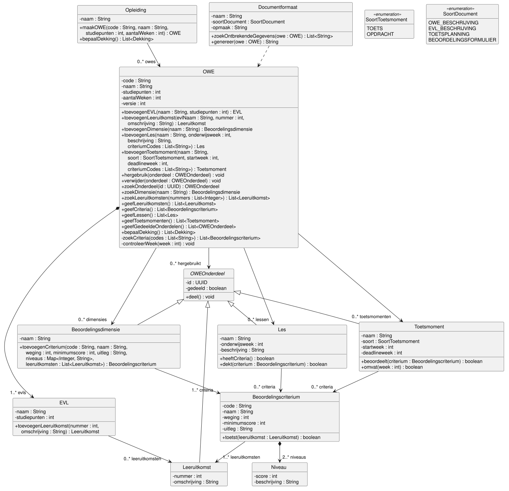
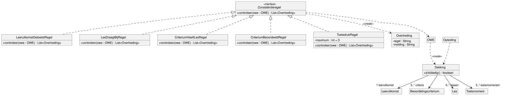
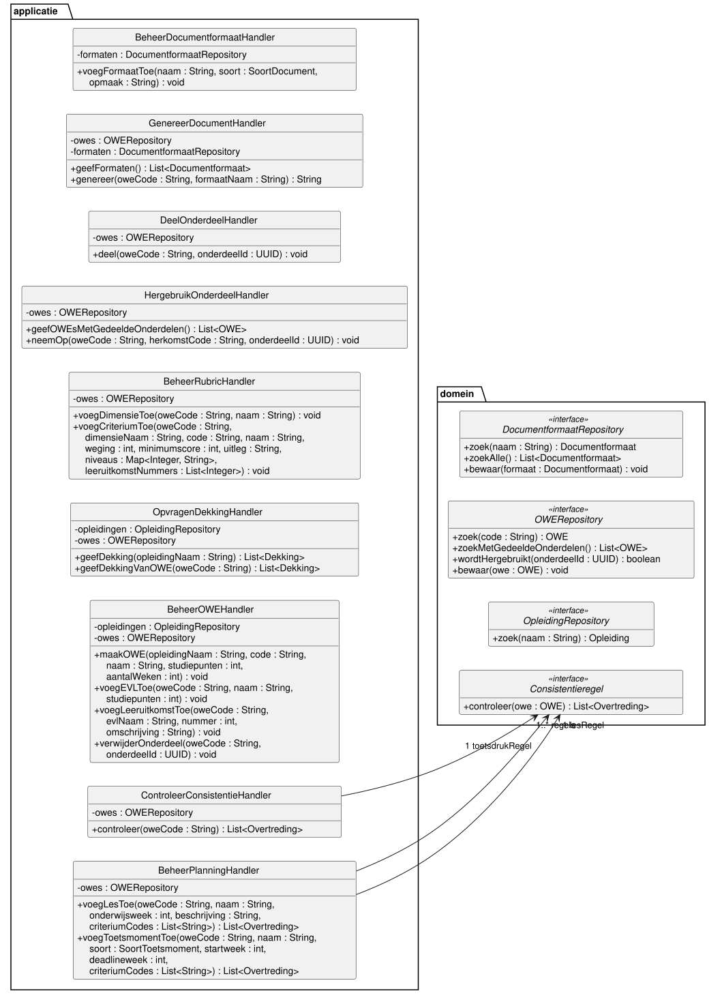

# Klassendiagram ICDE

Dit document toont het statische ontwerp van ICDE als design class diagram (DCD) en onderbouwt
de ontwerpbeslissingen.
Het bouwt voort op het [domeinmodel](domeinmodel.md) en de
[use case beschrijvingen](use-case-beschrijvingen.md).
Bronnen: de lessen Design Class Diagrams en "Van use case tot design" (week 2), GRASP Controller
(week 4), de richtlijnen bij Mastermind en Larman hoofdstuk 7 (UML Class Diagrams) en 17 (GRASP).

## Klassendiagrammen

Het ontwerp staat in drie diagrammen, zodat elk diagram leesbaar blijft.

Domeinklassen: de concepten uit het domeinmodel als softwareklassen.

Consistentieregels en dekking, voor UC05 Controleren consistentie OWE en UC08 Opvragen
dekkingsoverzicht.

Handlers en repositories: de klassen die de systeemoperaties ontvangen.

De bronnen zijn [klassendiagram-domein.puml](diagrams/klassendiagram-domein.puml),
[klassendiagram-controle.puml](diagrams/klassendiagram-controle.puml) en
[klassendiagram-handlers.puml](diagrams/klassendiagram-handlers.puml).

## Aanpak

We volgen de richtlijnen voor een design class diagram uit de cursus (Mastermind, dia 23).
Zoals Larman (7.4) adviseert, staan multipliciteit en rolnaam alleen aan de doelkant en heeft een
associatie geen naam.

De sequence diagrams volgen in #7.
Daarom leiden we de systeemoperaties nu af uit de stappen van de use cases, zoals een system
sequence diagram dat doet.
We verdelen de verantwoordelijkheden met de GRASP-patterns Controller, Creator, Information
Expert, Low Coupling en High Cohesion.
De sequence diagrams in #7 controleren dit ontwerp.
Wijkt een sequence diagram af, dan passen we dit klassendiagram aan.

## Van domeinmodel naar ontwerp

Het domeinmodel toont de werkelijkheid, het klassendiagram de software.
Dit veranderde:

| Wat | Domeinmodel | Klassendiagram |
| --- | --- | --- |
| Attributen | Alleen een naam | Visibility private en een datatype |
| Operaties | Geen | Uit de stappen van de use cases |
| Associaties | Naam, geen richting | Pijl, rolnaam en multipliciteit aan de doelkant |
| soort, soortDocument | Een attribuut | Enumeraties SoortToetsmoment en SoortDocument |
| OWE-onderdeel | Alleen gedeeld | Ook een id, zodat UC07 en UC09 een onderdeel kunnen aanwijzen |
| OWE | Geen versie | Een versie, zie keuze 9 |
| Nieuwe klassen | Geen | Handlers, repositories, consistentieregels, Overtreding, Dekking |

De elf concepten uit het domeinmodel zijn alle elf een klasse gebleven.
De namen blijven gelijk, zonder streepje: OWE-onderdeel heet OWEOnderdeel.
Het id is een UUID, zodat het uniek is over alle OWE's heen.

## Keuzes

1. Wie ontvangt een systeemoperatie? (GRASP Controller)
   - Probleem: ICDE heeft 11 use cases met samen meer dan 30 systeemoperaties.
   - Alternatief A: één facade controller ICDE.
     Die krijgt alle operaties en heeft dan een lage cohesie.
     Larman noemt dat een bloated controller.
   - Alternatief B: één use case controller per use case.
     Dat geeft 11 handlers, en vier daarvan doen hetzelfde: een OWE ophalen, een onderdeel
     toevoegen en de OWE bewaren.
   - Keuze: een use case controller per use case, met de naam van de use case en het achtervoegsel
     Handler, zoals Larman.
     CRUD use cases van dezelfde actor over dezelfde gegevens delen een handler, tot ongeveer 10
     systeemoperaties.
     Die grens komt uit "Van use case tot design".
     Zo delen UC01 en UC02 de BeheerOWEHandler, en UC04 en UC11 de BeheerPlanningHandler.
     UC03 heeft met dimensies, criteria en niveaus genoeg operaties voor een eigen handler.
     Use cases van verschillende actoren delen geen handler, omdat ze om verschillende redenen
     veranderen (Single Responsibility Principle).
     Daarom zijn UC07 en UC09 twee handlers, net als UC05 en UC08.
2. Hoe vindt een handler een OWE?
   - Probleem: een handler krijgt een code of naam en moet het object vinden.
     De casus eist dat de database op een eigen server draait.
   - Alternatief A: een rootobject Catalogus dat alle opleidingen in het geheugen houdt, zoals
     Store bij Larman.
     Dat laadt alle gegevens van alle opleidingen voor elke vraag.
   - Alternatief B: statische zoekoperaties op de domeinklassen, zoals OWE.zoek(code).
     Dan kent elke domeinklasse de database, en is de klasse moeilijk te testen.
   - Keuze: een repository-interface per ingang: OWERepository, OpleidingRepository en
     DocumentformaatRepository.
     De interface hoort bij het domein, de implementatie bij de datalaag.
     Zo hangt het domein niet af van de database (Dependency Inversion Principle).
     Welk data source pattern de implementatie gebruikt, bepalen we in #12.
3. Associaties in één richting.
   - Probleem: welke kant van elke associatie is navigeerbaar?
   - Alternatief: beide richtingen, zodat elk object zijn buren kent.
     Dat verdubbelt de koppeling, en beide kanten moeten gelijk blijven.
   - Keuze: elke associatie in één richting, van eigenaar naar onderdeel en van les of
     toetsmoment naar criterium (Low Coupling).
     Er is geen cyclus.
     De omgekeerde vraag, zoals "welke lessen dragen bij aan dit criterium?", beantwoordt OWE,
     want die kent alle lessen.
     Voor BR13 moet ICDE weten of een andere OWE een onderdeel hergebruikt.
     Dat vraagt de handler aan OWERepository.wordtHergebruikt, niet aan het onderdeel.
4. OWE is de ingang voor alle gegevens van een OWE. (GRASP Information Expert)
   - Probleem: de consistentieregels, de dekking en de documenten hebben alle leeruitkomsten,
     criteria, lessen en toetsmomenten van een OWE nodig.
     "Van de OWE" omvat ook de hergebruikte onderdelen.
   - Alternatief: elke regel loopt zelf de EVL's, dimensies en hergebruikte onderdelen langs.
     Dan kent elke regel de structuur van OWE en het verschil tussen eigen en hergebruikte
     onderdelen.
   - Keuze: OWE heeft geefLeeruitkomsten, geefCriteria, geefLessen en geefToetsmomenten.
     Die geven de eigen en de hergebruikte onderdelen samen.
     De rest van het systeem ziet het verschil niet (information hiding).
     Nadeel: OWE heeft 18 operaties.
     Zie de open punten.
5. Consistentieregels als aparte klassen.
   - Probleem: UC05 past BR1 tot en met BR5 toe.
     De opdrachtgever kan regels toevoegen of wijzigen, zie de open punten van de use cases.
   - Alternatief A: een operatie per regel in OWE.
     OWE krijgt dan nog meer verantwoordelijkheden, en een nieuwe regel wijzigt OWE.
   - Alternatief B: alle regels in ControleerConsistentieHandler.
     Dan zit domeinlogica in de handler, en UC04 en UC11 kunnen de regels niet hergebruiken.
   - Keuze: een interface Consistentieregel met een klasse per regel.
     ControleerConsistentieHandler loopt de lijst regels af en weet niet welke regels er zijn.
     Een nieuwe regel is een nieuwe klasse, zonder wijziging van bestaande code (Open/Closed
     Principle).
     BeheerPlanningHandler gebruikt dezelfde klassen voor BR2 (UC04, flow 7B) en BR5 (UC11,
     stap 8).
     ToetsdrukRegel heeft het maximum als attribuut, zodat een andere grens geen nieuwe klasse
     vraagt.
     Deze opzet lijkt op het Strategy pattern.
     De design patterns werken we uit in #9.
6. Wie maakt een document? (UC06)
   - Probleem: ICDE scheidt inhoud en vorm.
   - Alternatief A: OWE.genereer(formaat).
     Dan kent OWE de opmaak van documenten, en dat is niet zijn taak (High Cohesion).
   - Alternatief B: een generatorklasse per soort document.
     Dan vraagt een nieuwe soort document een nieuwe klasse, terwijl de functioneel beheerder
     formaten zonder programmeur wil aanpassen (UC10).
   - Keuze: Documentformaat maakt het document, want het kent zijn eigen opmaak (Information
     Expert).
     zoekOntbrekendeGegevens voert stap 4 uit, genereer stap 5.
     Documentformaat kent OWE alleen als parameter, dus als dependency en niet als associatie.
     Welke template-engine de opmaak leest, is een technologiekeuze voor blok 2.
7. Hergebruik als verwijzing, een kopie via de bestaande operaties. (UC07)
   - Probleem: een hergebruikt onderdeel toont altijd de actuele versie (BR6).
     Een kopie hangt niet meer af van het origineel (flow 5A).
   - Keuze voor de verwijzing: OWE.hergebruik voegt het originele object toe aan de lijst
     hergebruikt.
     Er is geen kopie, dus de OWE ziet elke wijziging meteen.
   - Alternatief voor de kopie: een abstracte operatie kopieer op OWEOnderdeel, met een
     uitwerking per subklasse.
     Die slaat de validatie over.
     Een gekopieerde les kan dan een onderwijsweek buiten de looptijd van de OWE hebben.
   - Keuze voor de kopie: de gebruikersinterface vult het toevoegscherm van het onderdeel met de
     inhoud uit stap 4.
     Het opslaan gaat via de gewone operaties, zoals toevoegenLes, met alle validatieregels.
     Een gekopieerd criterium verliest zijn koppeling met leeruitkomsten van de andere OWE.
     De ontwikkelaar koppelt het opnieuw.
8. Wie maakt een onderdeel? (GRASP Creator)
   - Keuze: de klasse die het onderdeel bevat, maakt het.
     Opleiding maakt OWE, OWE maakt EVL, dimensie, les en toetsmoment, EVL maakt leeruitkomst en
     dimensie maakt criterium.
   - Gevolg: OWE krijgt de criteriumcodes, niet de criteria zelf.
     OWE zoekt ze op in de eigen en hergebruikte dimensies.
     Een code van een andere OWE vindt OWE niet, en dat is een fout.
     Zo dwingt het ontwerp BR11 en BR14 af: een les of toetsmoment koppelt alleen criteria van de
     eigen OWE.
   - controleerWeek is private en controleert BR11 en BR14 voor onderwijsweek, startweek en
     deadlineweek.
9. Samenwerken zonder versieconflicten.
   - Probleem: twee ontwikkelaars wijzigen tegelijk dezelfde OWE.
     Geen van beide wijzigingen mag onopgemerkt verloren gaan (niet-functionele eis).
   - Alternatief: een OWE vergrendelen zolang iemand hem wijzigt.
     Dan wacht de tweede ontwikkelaar, ook als de wijzigingen elkaar niet raken.
   - Keuze: OWE heeft een versie.
     OWERepository.bewaar weigert een OWE met een oude versie, en de ontwikkelaar ziet dat.
     Het data source pattern hiervoor werken we uit in #12.

## Traceerbaarheid

Per use case: de handler en de klassen die de use case uitvoeren.

- UC01 Beheren OWE: BeheerOWEHandler.
  Opleiding.maakOWE, OWE.toevoegenEVL.
- UC02 Beheren leeruitkomsten: BeheerOWEHandler.
  OWE.toevoegenLeeruitkomst, EVL.toevoegenLeeruitkomst.
- UC03 Beheren beoordelingscriteria: BeheerRubricHandler.
  OWE.toevoegenDimensie, Beoordelingsdimensie.toevoegenCriterium.
- UC04 Beheren lesplanning: BeheerPlanningHandler.
  OWE.toevoegenLes, LesDraagtBijRegel.
- UC05 Controleren consistentie OWE: ControleerConsistentieHandler.
  Consistentieregel en vijf regels, Overtreding.
- UC06 Genereren document: GenereerDocumentHandler.
  Documentformaat.zoekOntbrekendeGegevens, genereer.
- UC07 Hergebruiken gedeeld onderdeel: HergebruikOnderdeelHandler.
  OWE.geefGedeeldeOnderdelen, OWE.hergebruik.
- UC08 Opvragen dekkingsoverzicht: OpvragenDekkingHandler.
  Opleiding.bepaalDekking, OWE.bepaalDekking, Dekking.
- UC09 Delen OWE-onderdeel: DeelOnderdeelHandler.
  OWEOnderdeel.deel.
- UC10 Beheren documentformaat: BeheerDocumentformaatHandler.
  Documentformaat.
- UC11 Beheren toetsplanning: BeheerPlanningHandler.
  OWE.toevoegenToetsmoment, ToetsdrukRegel.

Verwijderen van een onderdeel (UC02, UC03, UC04, UC11) loopt via
BeheerOWEHandler.verwijderOnderdeel en OWE.verwijder.
Dat kan met één operatie, omdat alle onderdelen een OWEOnderdeel zijn.

Per bedrijfsregel: de klasse die de regel controleert.

| Regel | Klasse en operatie |
| --- | --- |
| BR1 | LeeruitkomstGetoetstRegel, met Beoordelingscriterium.toetst |
| BR2 | LesDraagtBijRegel, met Les.heeftCriteria |
| BR3 | CriteriumHeeftLesRegel, met Les.dekt |
| BR4 | CriteriumBeoordeeldRegel, met Toetsmoment.beoordeelt |
| BR5 | ToetsdrukRegel, met Toetsmoment.omvat |
| BR6 | OWE.hergebruik bewaart een verwijzing, geen kopie |
| BR7 | Alleen de OWE die het onderdeel in de eigen lijsten heeft, wijzigt het |
| BR8 | BeheerOWEHandler.maakOWE, met OWERepository.zoek voor een unieke code |
| BR9 | EVL.toevoegenLeeruitkomst, met OWE voor een uniek nummer |
| BR10 | Beoordelingsdimensie.toevoegenCriterium |
| BR11 | OWE.toevoegenLes, met controleerWeek en zoekCriteria |
| BR12 | BeheerDocumentformaatHandler, met DocumentformaatRepository.zoek |
| BR13 | BeheerOWEHandler.verwijderOnderdeel, met OWERepository.wordtHergebruikt |
| BR14 | OWE.toevoegenToetsmoment, met controleerWeek en zoekCriteria |

## Wat niet in de diagrammen staat

- Getters en setters.
  Ze voegen veel regels toe en weinig informatie (Larman 7.6).
- Constructors.
  De operaties die een object maken (keuze 8) tonen al wie wat maakt.
- Wijzigen en bekijken bij de CRUD use cases.
  Die volgen het CRUD-sjabloon, met dezelfde parameters als toevoegen.
  De diagrammen tonen toevoegen, net als de use case beschrijvingen.
- Foutmeldingen.
  Een operatie die een validatieregel of een exceptional flow tegenkomt, gooit een
  OngeldigeInvoerException met de melding.
  Voorbeelden: UC05 flow 2A, UC06 flow 4A, UC07 flow 6A en flow 7A bij UC04 en UC11.
- De gebruikersinterface en de implementatie van de repositories.
  Die horen bij de technologiekeuze in blok 2.

## Open punten

- De sequence diagrams in #7 controleren de operaties en de dependencies in dit ontwerp.
- OWE heeft 18 operaties.
  Blijkt in #7 dat OWE te veel doet, dan splitsen we de zoek- en geef-operaties af naar een eigen
  klasse.
- ICDE geeft domeinobjecten terug aan de gebruikersinterface, zoals List<OWE> in UC07.
  Draait de gebruikersinterface op een eigen server, dan worden dat Data Transfer Objects (#10).
