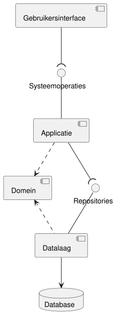

# Ontwerpdocument ICDE

Dit document is de ingang van het ontwerp van ICDE.
Het is bedoeld voor wie ICDE in blok 2 bouwt, en voor reviewers en docenten.
Het legt de architectuur vast, geeft een overzicht van de modellen en ontwerpkeuzes, en controleert
of het ontwerp consistent is met de requirements.
De modellen zelf staan in de documenten waar dit document naar verwijst.
Bronnen: de leeruitkomst Software Design Modeling in de Modulebeschrijving, het voorbeeld "Van
use case tot design" (week 2) en de les Design Review.

## Leeswijzer

De les Design Review splitst de documentatie in een requirements-specificatie (SRS) en een
ontwerp (SDD).
Lees de documenten in deze volgorde:

| Deel | Document | Inhoud | Criterium B_Casus1 |
| --- | --- | --- | --- |
| SRS | [systeemgrenzen.md](systeemgrenzen.md) | Actoren, scope, open vragen | 1 |
| SRS | [use-cases.md](use-cases.md) | Use case diagram, 11 use cases | 1 |
| SRS | [use-case-beschrijvingen.md](use-case-beschrijvingen.md) | Fully dressed, BR1-BR14 | 1 |
| SRS | [domeinmodel.md](domeinmodel.md) | Domeinmodel, 11 concepten | 2 |
| SRS | [domeinmodel-validatie.md](domeinmodel-validatie.md) | Domeinmodel tegen use cases | 2 |
| SDD | Dit document | Architectuur, keuzes, consistentie | 3.1, 3.2, 4 |
| SDD | [klassendiagram.md](klassendiagram.md) | Statisch ontwerp, traceerbaarheid | 3.1, 3.2 |
| SDD | [sequencediagrammen.md](sequencediagrammen.md) | Dynamisch ontwerp | 3.1, 3.2 |

## Architectuur

De casus eist dat gebruikersinterface, domeinlogica en database elk op een eigen server draaien.
Het component diagram toont de lagen en de interfaces ertussen.

De bron is [componentdiagram.puml](diagrams/componentdiagram.puml).

| Component | Inhoud | Server |
| --- | --- | --- |
| Gebruikersinterface | Schermen, buiten dit ontwerp | Webserver |
| Applicatie | De handlers, package `applicatie` | Applicatieserver |
| Domein | Domeinklassen, regels, repository-interfaces, package `domein` | Applicatieserver |
| Datalaag | De implementatie van de repositories | Applicatieserver |
| Database | De gegevens | Databaseserver |

- Systeemoperaties zijn de operaties van de handlers.
  Het zijn de systeemoperaties uit de system sequence diagrams.
- Repositories zijn de interfaces OWERepository, OpleidingRepository en DocumentformaatRepository.
  Ze horen bij het domein, en de datalaag implementeert ze (keuze 2 in het klassendiagram).
  De datalaag hangt dus af van het domein, niet andersom.

Keuze A1: waar draait de domeinlogica?

- Probleem: de consistentieregels, de validatieregels en het genereren van documenten moeten
  ergens draaien.
  Meerdere gebruikers werken tegelijk aan dezelfde OWE.
- Alternatief A: in de gebruikersinterface, met een server die alleen gegevens opslaat.
  Dan draait elke regel op elke client.
  Een latere koppeling met OnderwijsOnline of Alluris moet de regels opnieuw bouwen.
- Alternatief B: in de database, als stored procedures en constraints.
  Een regel als BR5 (toetsen per week) is dan moeilijk te schrijven en te testen.
  De regels hangen dan af van één databaseproduct, en OO-patterns zoals Strategy zijn niet
  bruikbaar.
- Keuze: een eigen applicatie- en domeinlaag op de applicatieserver.
  Elke regel staat op één plaats, voor alle gebruikers en latere koppelingen.
  Gebruikersinterface en database zijn vervangbaar zonder het domein te wijzigen (Low Coupling).

## Ontwerpmodellen

| Soort | Model | Waar |
| --- | --- | --- |
| Statisch | Component diagram | [Architectuur](#architectuur) |
| Statisch | Design class diagram, in drie diagrammen | [klassendiagram.md](klassendiagram.md) |
| Dynamisch | Vier system sequence diagrams | [sequencediagrammen.md](sequencediagrammen.md) |
| Dynamisch | Negen sequence diagrams | [sequencediagrammen.md](sequencediagrammen.md) |

ICDE heeft veel interactie tussen objecten, zoals de consistentiecontrole en het
dekkingsoverzicht.
Daarom toont het ontwerp naast statische ook dynamische modellen.

## Ontwerpkeuzes

Elke keuze beschrijft het probleem, de alternatieven en de reden.
Deze tabel geeft het overzicht.
K staat voor [klassendiagram.md](klassendiagram.md#keuzes), S voor
[sequencediagrammen.md](sequencediagrammen.md#keuzes).

| Keuze | Probleem | Principe of pattern |
| --- | --- | --- |
| A1 | Waar draait de domeinlogica? | Low Coupling, lagen |
| K1 | Wie ontvangt een systeemoperatie? | GRASP Controller, SRP |
| K2 | Hoe vindt een handler een OWE? | Repository, DIP |
| K3 | Welke kant van een associatie is navigeerbaar? | Low Coupling |
| K4 | Wie geeft alle gegevens van een OWE? | Information Expert, information hiding |
| K5 | Waar staan de consistentieregels? | OCP, lijkt op Strategy |
| K6 | Wie maakt een document? | Information Expert, High Cohesion |
| K7 | Hergebruik als verwijzing of kopie? | Validatie op één plaats |
| K8 | Wie maakt een onderdeel? | GRASP Creator |
| K9 | Hoe samenwerken zonder versieconflicten? | Versienummer per OWE |
| S1 | Waar staat een foutcontrole? | Information Expert |
| S2 | Welke overtredingen horen bij een nieuw onderdeel? | Eén plaats per regel |
| S3 | Hoe vindt de handler een gedeeld onderdeel? | Encapsulation (BR7) |
| S4 | Is OWE te groot? | High Cohesion |

De verbeteringen C1 tot en met C4 hebben ook alternatieven, zie
[Inconsistenties](#inconsistenties).
De design patterns werken we uit in #9.

## Eisen uit de casus

De [traceerbaarheid](klassendiagram.md#traceerbaarheid) in het klassendiagram koppelt elke use
case en elke bedrijfsregel aan het ontwerp.
Deze tabel doet dat voor de eisen uit de casus en de Modulebeschrijving.

| Eis | Ontwerp | Status |
| --- | --- | --- |
| Samenwerken zonder versieconflicten | OWE.versie, OWERepository.bewaar (K9) | Ontworpen, #12 |
| Scheiding van inhoud en vorm | Documentformaat (K6), UC10 | Ontworpen |
| Inconsistenties detecteren | Consistentieregel en vijf regels (K5) | Ontworpen |
| Lessen sluiten aan op toetsen | CriteriumHeeftLesRegel en CriteriumBeoordeeldRegel | Ontworpen |
| Meer dan 3 toetsen in een week | ToetsdrukRegel (BR5), ook in UC11 | Ontworpen |
| EVL-beschrijving en toetsplanning | SoortDocument, zie onder | Ontworpen |
| Onderdelen delen | OWEOnderdeel.deel, OWE.hergebruik (K7) | Ontworpen |
| Overzicht van de dekking | Opleiding.bepaalDekking, Dekking | Ontworpen |
| Uitbreidbaar, HAN-breed | Nieuwe regel is een nieuwe klasse, nieuw formaat is data | Ontworpen |
| Drie servers | Component diagram | Ontworpen, uitwerking in #10 en #14 |
| Iterative Grading | Geen, buiten het use case diagram | Later |
| Koppeling OnderwijsOnline, Alluris | Geen, buiten het use case diagram | Later |

De toetsplanning als tabel en als overzicht per week zijn twee documentformaten van de soort
TOETSPLANNING.
Een latere koppeling roept dezelfde systeemoperaties aan als de gebruikersinterface.

## Consistentie met de requirements

We controleren het ontwerp in twee richtingen, zoals bij de
[validatie van het domeinmodel](domeinmodel-validatie.md).
Van requirement naar ontwerp: elke use case, bedrijfsregel en eis heeft een klasse en een operatie.
Van ontwerp naar requirement: elke klasse en operatie dient een use case, regel of eis.

### Wat klopt

- Elke use case heeft een handler, zie de traceerbaarheid in het klassendiagram.
- Elke bedrijfsregel heeft een klasse die haar controleert.
  Acht regels staan ook in een sequence diagram.
- Elke systeemoperatie uit de SSD's is een operatie van een handler, met dezelfde naam en
  parameters.
- Elk sequence diagram gebruikt alleen operaties en associaties uit het klassendiagram.
  Getters en constructors zijn de uitzondering, zie de aanpak in de sequence diagrams.
- Elke klasse komt voor in een use case of bedrijfsregel.
  Handlers en repositories dienen de systeemoperaties, Overtreding en Dekking dienen UC05 en UC08.
- Elke exceptional flow van de uitgewerkte use cases geeft een OngeldigeInvoerException.

### Inconsistenties

C1 tot en met C4 hebben we in deze versie van het ontwerp verwerkt.
C5 hangt af van een open vraag.

1. C1: UC08 toont de dekking per OWE, maar Dekking kende haar OWE niet.
   Opleiding.bepaalDekking gaf één lijst over alle OWE's, en de navigatie loopt niet van
   leeruitkomst naar OWE (K3).
   - Alternatief: een associatie van Dekking naar OWE.
     Dan krijgt de gebruikersinterface via Dekking de hele OWE.
   - Verbetering: Dekking krijgt het attribuut oweCode.
     OWE geeft die mee bij `create` in SD OWE.bepaalDekking.
2. C2: BR8 eist minstens één EVL, maar maakOWE bewaarde een OWE zonder EVL.
   De EVL kwam pas met een tweede systeemoperatie toevoegenEVL.
   - Alternatief: OWERepository.bewaar controleert BR8.
     Dan kent de datalaag een regel van het domein.
   - Verbetering: BeheerOWEHandler.maakOWE krijgt evlNaam en evlStudiepunten.
     De handler maakt de OWE en haar eerste EVL voordat hij de OWE bewaart.
3. C3: UC01 verwijdert een OWE met BR13, maar het ontwerp had daar geen operatie voor.
   verwijderOnderdeel werkt alleen voor een OWEOnderdeel, en een OWE is dat niet.
   - Verbetering: BeheerOWEHandler.verwijderOWE en OWERepository.verwijder.
     De handler vraagt wordtHergebruikt voor elk onderdeel uit owe.geefGedeeldeOnderdelen.
     Alleen een gedeeld onderdeel kan hergebruikt zijn.
4. C4: BR12 eist dat een formaat alleen gegevens gebruikt die een OWE heeft.
   Het ontwerp controleerde dat pas bij het genereren (UC06, 4A).
   Dan ziet de onderwijsontwikkelaar een fout van de functioneel beheerder.
   - Verbetering: Documentformaat.zoekOnbekendeGegevens geeft de gegevens in de opmaak die geen
     OWE heeft.
     BeheerDocumentformaatHandler weigert het formaat als die lijst niet leeg is (UC10).
     Documentformaat kent zijn opmaak, dus het controleert die zelf (Information Expert).
5. C5: elke use case eist een ingelogde gebruiker, en UC09 is alleen voor de
   opleidingscoördinator.
   Het ontwerp controleert geen gebruiker of rol.
   - Verbetering: de remote facade in #10 controleert de rol per handler.
     Omdat de handlers per actor zijn verdeeld (K1), is dat één controle per handler.
     Hoe ICDE de gebruiker kent, hangt af van open vraag 3 in de
     [systeemgrenzen](systeemgrenzen.md#open-vragen-voor-de-opdrachtgever).

## Overdracht naar blok 2

Dit ontwerp is de basis voor de gedistribueerde applicatie.
Deze punten liggen nog open, met het issue dat ze uitwerkt:

| Issue | Wat het ontwerp vastlegt | Wat nog open is |
| --- | --- | --- |
| #9 | Consistentieregel als interface | Design patterns uitwerken |
| #10 | Systeemoperaties op de handlers | Remote facade, DTO's, rolcontrole (C5) |
| #11 | Grens tussen gebruikersinterface en applicatie | REST-resources |
| #12 | Repository-interfaces, OWE.versie | Data source pattern, weigeren van een oude versie |
| #13 | Schermen buiten het ontwerp | Presentatiepattern |
| #14 | Lagen en componenten | Talen, frameworks, template-engine voor Documentformaat |
| #15 | Drie servers | Deployment |

De open vragen voor de opdrachtgever staan in [systeemgrenzen.md](systeemgrenzen.md) en
[use-case-beschrijvingen.md](use-case-beschrijvingen.md#open-punten).
