# Sequence diagrams ICDE

Dit document toont het dynamische ontwerp van ICDE: hoe de objecten samenwerken om de
kern-use-cases uit te voeren.
Het bouwt voort op de [use case beschrijvingen](use-case-beschrijvingen.md) en het
[klassendiagram](klassendiagram.md).
Bronnen: de lessen System Sequence Diagrams, Thema 4-1 Sequence Diagrams en "Van use case tot
design" (week 2), Sequence diagrams en GRASP Controller (week 4), de richtlijnen bij Mastermind en
Larman hoofdstuk 4 (System Sequence Diagrams) en 8 (UML Interaction Diagrams).

## Aanpak

We volgen de werkwijze uit de cursus (Sequence diagrams, dia 8 en 9) en de richtlijnen bij
Mastermind (dia 20).
Per use case levert een system sequence diagram (SSD) de systeemoperaties.
Per systeemoperatie toont een sequence diagram (SD) hoe de handler uit het klassendiagram het werk
verdeelt (GRASP Controller).
Een systeemoperatie die alleen een repository aanroept, krijgt geen SD.

Wat de SD's weglaten of anders tonen:

- De gebruikersinterface staat niet in de SD's, zoals in "Van use case tot design".
  De actor stuurt de systeemoperatie direct naar de handler.
- Een exception staat als stippellijn met de naam `OngeldigeInvoerException` en de flow uit de
  use case, zoals (2A).
- De SD's gebruiken getters die het klassendiagram niet toont, zoals `getAantalWeken` en
  `isGedeeld` (Larman 7.6).
  Ze maken objecten met `create`, en het klassendiagram toont geen constructors.

## Keuze van de use cases

We maken SD's voor de use cases die fully dressed zijn uitgewerkt, omdat daar de logica zit:
UC05, UC06, UC07, UC08, UC04 en UC11.
De andere CRUD use cases volgen het CRUD-sjabloon en hebben geen eigen logica.
Hun systeemoperaties staan in de [traceerbaarheid](klassendiagram.md#traceerbaarheid) van het
klassendiagram.

## System sequence diagrams

Het SSD gebruikt parameters zonder datatype, omdat het bij de analyse hoort (Van use case tot
design, par. 7).
UC04 en UC11 hebben geen SSD: Toevoegen les en Toevoegen toetsmoment hebben elk één
systeemoperatie, zie de tabel hieronder.

UC05 Controleren consistentie OWE:

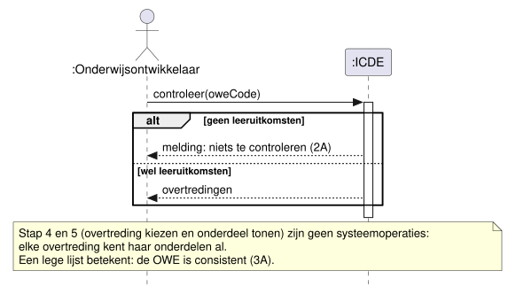

UC06 Genereren document:

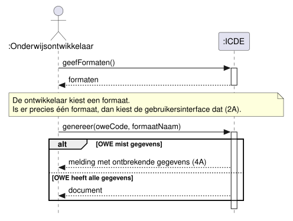

UC07 Hergebruiken gedeeld onderdeel:

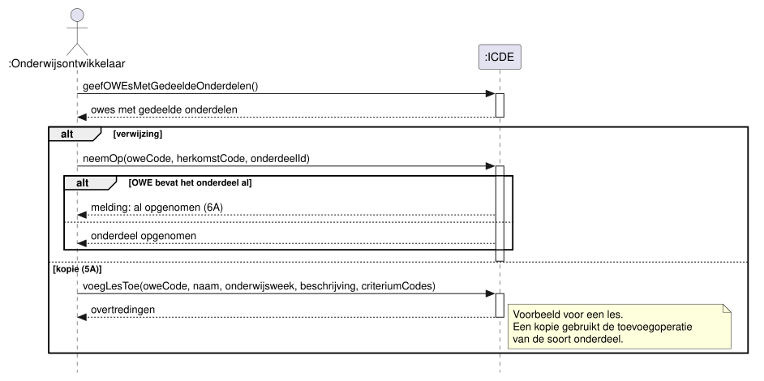

UC08 Opvragen dekkingsoverzicht:

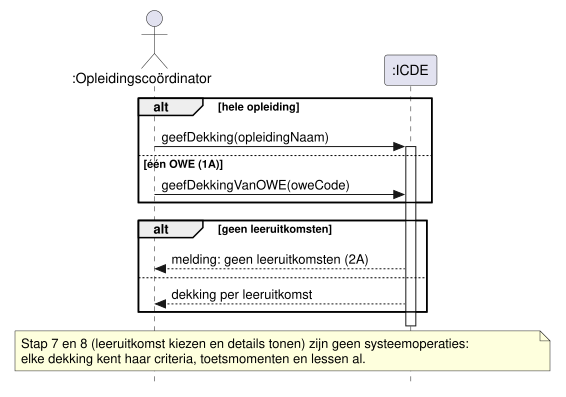

## Systeemoperaties

| Use case | Systeemoperatie | Handler | Sequence diagram |
| --- | --- | --- | --- |
| UC05 | controleer | ControleerConsistentieHandler | SD controleer, SD BR1, SD BR5 |
| UC06 | geefFormaten | GenereerDocumentHandler | Geen, zie onder |
| UC06 | genereer | GenereerDocumentHandler | SD genereer |
| UC07 | geefOWEsMetGedeeldeOnderdelen | HergebruikOnderdeelHandler | Geen, zie onder |
| UC07 | neemOp | HergebruikOnderdeelHandler | SD neemOp |
| UC08 | geefDekking | OpvragenDekkingHandler | SD geefDekking, SD OWE.bepaalDekking |
| UC08 | geefDekkingVanOWE | OpvragenDekkingHandler | SD OWE.bepaalDekking |
| UC04 | voegLesToe | BeheerPlanningHandler | SD voegLesToe |
| UC11 | voegToetsmomentToe | BeheerPlanningHandler | SD voegToetsmomentToe |

Drie systeemoperaties hebben geen eigen SD.
`geefFormaten` roept alleen `formaten.zoekAlle()` aan.
`geefOWEsMetGedeeldeOnderdelen` roept alleen `owes.zoekMetGedeeldeOnderdelen()` aan.
`geefDekkingVanOWE` zoekt de OWE met `owes.zoek` en volgt dan SD OWE.bepaalDekking.

Stap 4 en 5 van UC05, stap 4 van UC07 en stap 7 en 8 van UC08 zijn geen systeemoperaties.
De gebruikersinterface heeft de gegevens al uit de vorige systeemoperatie.
Een kopie in UC07 (5A) gebruikt de toevoegoperatie van de soort onderdeel, zie keuze 7 in het
klassendiagram.

## Sequence diagrams

### UC05 Controleren consistentie OWE

`controleer` voert stap 1 tot en met 3 uit.
De handler kent alleen de interface Consistentieregel.
`controleer(owe)` op een regel is een polymorfe message: elke regel werkt haar eigen controle uit.

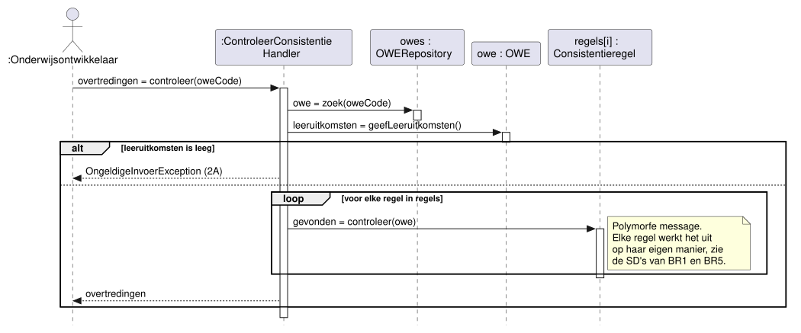

De cursus vraagt een apart SD per concrete uitwerking van een polymorfe message (Sequence
diagrams, dia 30, en Larman figuur 8.21).
We tekenen BR1 en BR5, omdat die twee verschillende vormen hebben.

BR1 LeeruitkomstGetoetstRegel zoekt per leeruitkomst een criterium dat haar toetst:

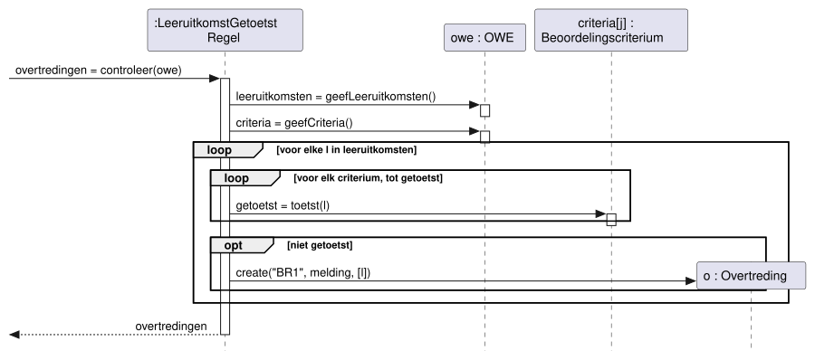

BR2, BR3 en BR4 hebben dezelfde vorm als BR1, met een andere lus en vraag:

| Regel | Lus over | Vraag per element |
| --- | --- | --- |
| BR2 LesDraagtBijRegel | `owe.geefLessen()` | `les.heeftCriteria()` |
| BR3 CriteriumHeeftLesRegel | `owe.geefCriteria()` | `les.draagtBijAan(c)`, voor elke les |
| BR4 CriteriumBeoordeeldRegel | `owe.geefCriteria()` | `t.beoordeelt(c)`, voor elk toetsmoment |

BR5 ToetsdrukRegel telt per week de lopende toetsmomenten.
UC11 gebruikt dezelfde regel.

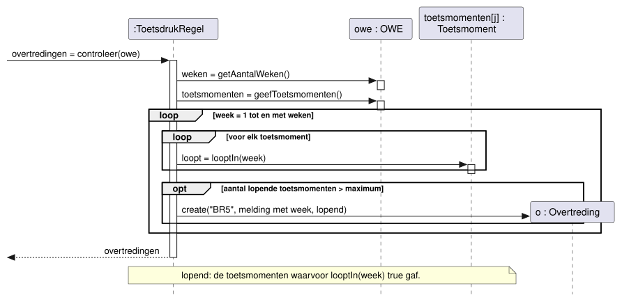

### UC06 Genereren document

`genereer` voert stap 3 tot en met 6 uit.
Documentformaat controleert eerst of de OWE alle gegevens heeft (stap 4) en maakt dan het document
(stap 5).

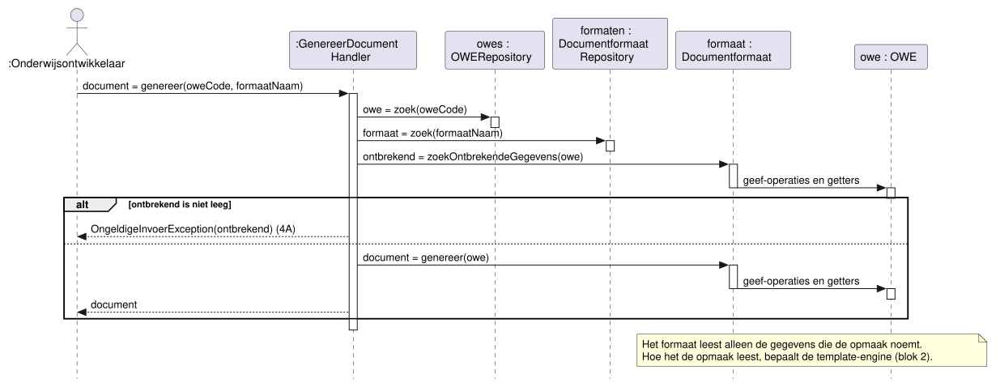

### UC07 Hergebruiken gedeeld onderdeel

`neemOp` voert stap 5 en 6 uit.
OWE controleert of het onderdeel gedeeld is en of de OWE het al bevat (6A).
OWE bewaart een verwijzing naar het originele object, zodat de OWE elke wijziging ziet (BR6).

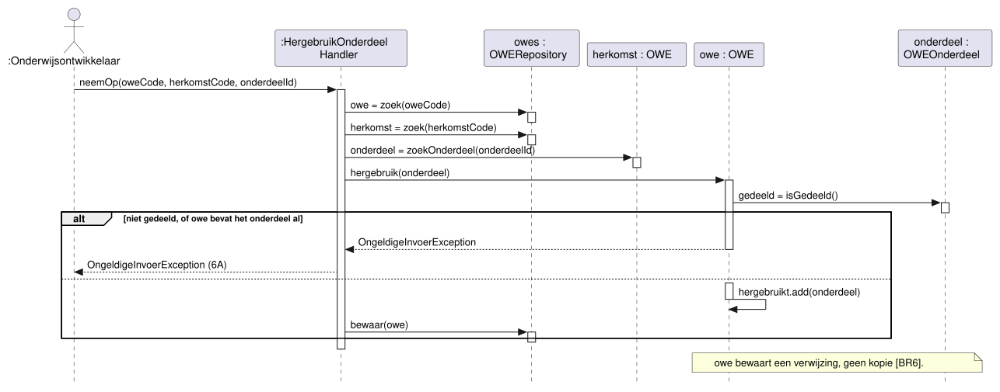

### UC08 Opvragen dekkingsoverzicht

`geefDekking` voert stap 1 tot en met 6 uit.
Opleiding vraagt elke OWE om haar dekking.

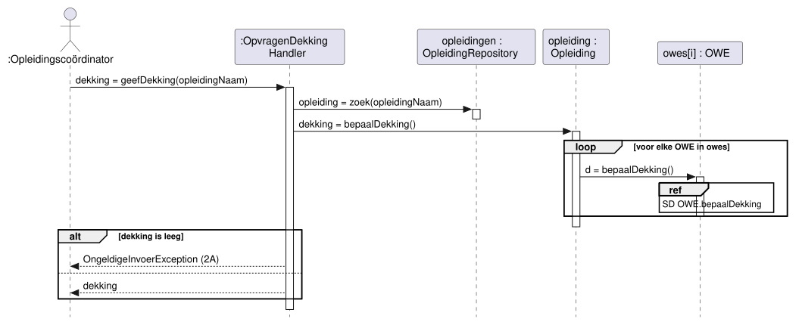

OWE bepaalt de dekking, omdat OWE alle leeruitkomsten, criteria, toetsmomenten en lessen kent
(Information Expert, keuze 4 in het klassendiagram).
OWE maakt de Dekking-objecten (Creator), omdat OWE de gegevens voor de constructor heeft.

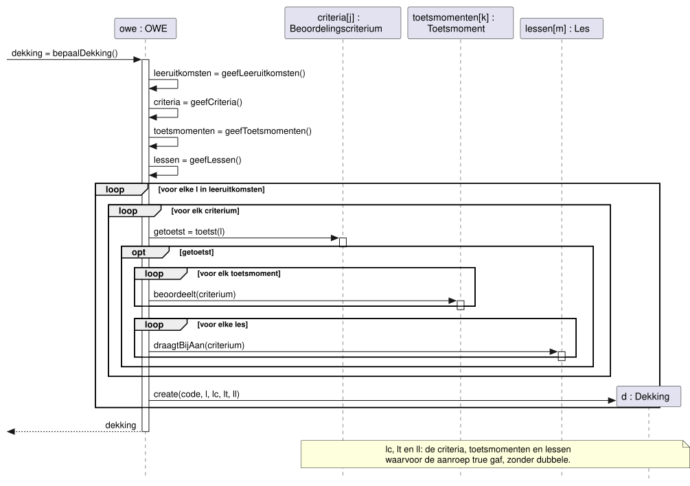

### UC04 Beheren lesplanning

`voegLesToe` voert stap 5 tot en met 7 van Toevoegen les uit.
OWE maakt de les (Creator) en controleert de week en de criteria (BR11).
Na het bewaren vraagt de handler LesDraagtBijRegel om BR2.
Van alle overtredingen geeft de handler alleen die van de nieuwe les terug (7B).

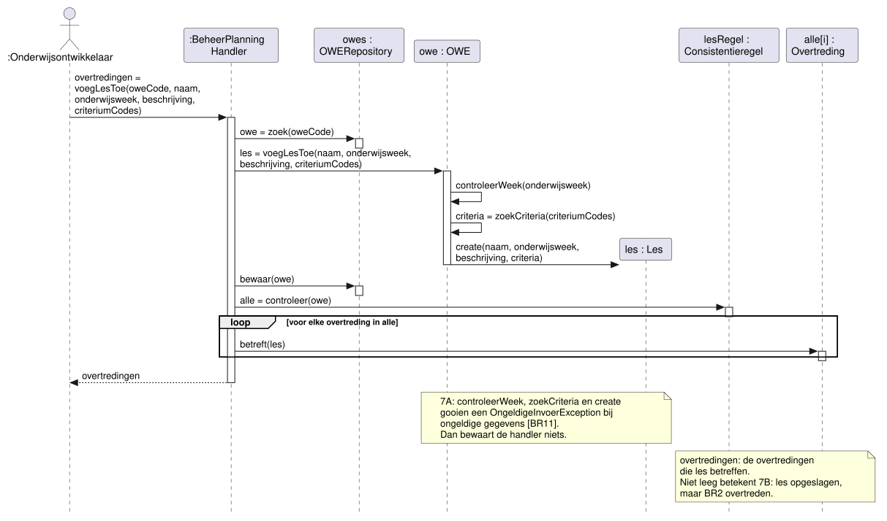

### UC11 Beheren toetsplanning

`voegToetsmomentToe` voert stap 5 tot en met 8 van Toevoegen toetsmoment uit.
Het volgt hetzelfde patroon als `voegLesToe`, met BR14 en ToetsdrukRegel (BR5).

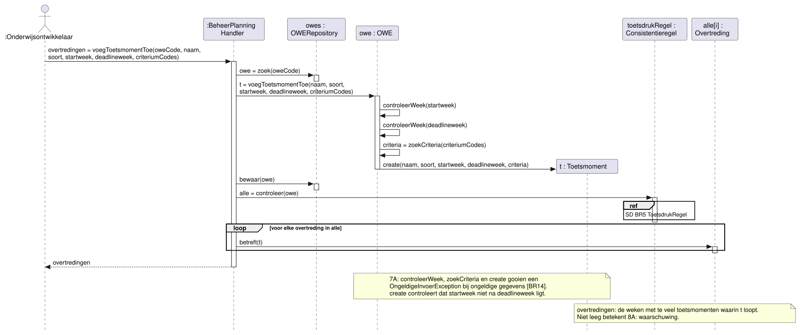

## Keuzes

1. Waar staat een foutcontrole?
   - Probleem: de use cases hebben exceptional flows, zoals 2A in UC05 en 7A in UC04.
   - Alternatief: de handler controleert alle invoer voordat hij het domein aanroept.
     Dan kent de handler de regels van het domein, en groeit hij tot een bloated controller
     (GRASP Controller, dia 15).
   - Keuze: het object dat de gegevens heeft, controleert ze (Information Expert).
     OWE controleert de week (`controleerWeek`), Toetsmoment de volgorde van start- en
     deadlineweek.
     De handler controleert alleen of er iets te doen is, zoals 2A in UC05 en UC08.
2. Hoe vindt de handler de overtredingen van één nieuwe les of één nieuw toetsmoment?
   - Probleem: UC04 (7B) en UC11 (8A) melden alleen een overtreding van het nieuwe onderdeel.
     Een consistentieregel controleert de hele OWE.
   - Alternatief A: een tweede operatie op elke regel, zoals `controleer(owe, onderdeel)`.
     Dan heeft de interface twee operaties die bijna hetzelfde doen.
   - Alternatief B: de handler controleert BR2 zelf met `les.heeftCriteria()`.
     Dan staat BR2 op twee plaatsen, en BR5 kan zo niet: die telt over alle toetsmomenten.
   - Keuze: Overtreding kent haar onderdelen en beantwoordt `betreft(onderdeel)`.
     De handler filtert de overtredingen van de regel.
     Zo blijft elke regel op één plaats.
3. Hoe vindt de handler een gedeeld onderdeel van een andere OWE? (UC07)
   - Probleem: `neemOp` kreeg alleen de id van het onderdeel.
     OWERepository zoekt op de code van een OWE, niet op de id van een onderdeel.
   - Alternatief: een nieuwe operatie `OWERepository.zoekOnderdeel(id)`.
     Die geeft een onderdeel los van zijn OWE, en dan kan de handler het wijzigen buiten de OWE
     van herkomst om (BR7).
   - Keuze: `neemOp` krijgt ook de code van de OWE van herkomst.
     De gebruikersinterface kent die al uit stap 2.
     De handler vraagt het onderdeel aan die OWE met de bestaande `zoekOnderdeel`.
4. Is OWE te groot?
   - Probleem: OWE heeft 18 operaties, zie keuze 4 in het klassendiagram.
   - Alternatief: de zoek- en geef-operaties naar een eigen klasse.
     Die klasse moet dan alle lijsten van OWE kennen, en OWE geeft zijn structuur prijs.
   - Keuze: OWE blijft zoals hij is.
     De SD's laten zien dat elke operatie van OWE kort is en alleen zijn eigen lijsten gebruikt.
     De cohesie is dus hoog, ook met 18 operaties.

## Open punten

- De SD's tonen de gebruikersinterface niet.
  In blok 2 draaien gebruikersinterface en domein op verschillende servers.
  Dan komen er Data Transfer Objects tussen de actor en de handler (#10).
- `bewaar` kan een OWE met een oude versie weigeren (keuze 9 in het klassendiagram).
  De SD's tonen dat niet.
  Het data source pattern daarvoor werken we uit in #12.
