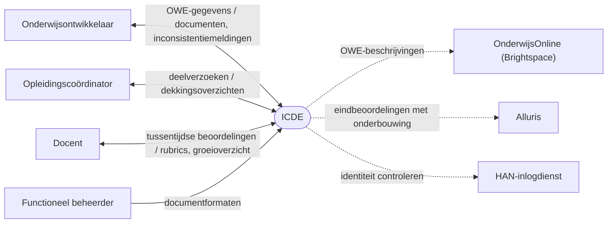

# Systeemgrenzen ICDE

Dit document bepaalt de grens van ICDE (Integrated Course Design Environment).
We bekijken ICDE als black box: wat het systeem doet en met wie het communiceert, niet hoe.
Het is de basis voor het use case diagram (#2) en de uitgewerkte use cases (#3).
Bronnen: de ICDE-casus in [README.md](../README.md) en de Modulebeschrijving van de toets Casus.
De Modulebeschrijving noemt extra wensen van de opdrachtgever, zie
[Aanvullende wensen](#aanvullende-wensen-van-de-opdrachtgever).

## ICDE als black box

ICDE ondersteunt het administratieve deel van het ontwikkelen van onderwijs.
Het systeem doet het volgende:

- Het bewaart de gegevens van een onderwijseenheid (OWE) als data, los van de vorm.
  Dit zijn leeruitkomsten, beoordelingsdimensies, beoordelingscriteria (rubrics), de
  toetsplanning en de lesplanning.
- Het genereert documenten uit die data, zoals OWE-beschrijvingen, EVL-beschrijvingen,
  toetsplanningen en beoordelingsformulieren.
  De formaten zijn aanpasbaar zonder de inhoud te wijzigen.
- Het detecteert inconsistenties.
  Voorbeelden: een beoordelingscriterium zonder bijbehorend onderwijs, een les die niet
  bijdraagt aan een toets, of een week met meer dan 3 toetsen.
- Het laat meerdere ontwikkelaars aan dezelfde OWE werken zonder versieconflicten.
- Het maakt onderdelen deelbaar tussen opleidingen en profielen.
- Het levert gegevens voor Iterative Grading.

ICDE doet het volgende niet:

- Het is geen leeromgeving.
  Studenten volgen hun onderwijs in OnderwijsOnline (Brightspace).
- Het is geen cijferadministratie.
  Eindbeoordelingen staan in Alluris.
- Het beoordeelt de inhoud van onderwijs niet.
  Het signaleert inconsistenties, en de ontwikkelaar beslist wat er verandert.

### Begrippen

- Een OWE (onderwijseenheid) is een module, zoals OOSE-DT.
- Een OWE bestaat uit een of meer eenheden van leeruitkomsten (EVL's).
  OOSE-DT heeft bijvoorbeeld de EVL's Software Analysis & Design en Distributed Application
  Development.
- Een EVL groepeert leeruitkomsten en de toetsen die ze beoordelen.
  De EVL-beschrijving is een van de documenten die ICDE genereert.
- Een toetsmoment is een toets of opdracht in de toetsplanning.
  Het loopt van een startweek tot en met een deadlineweek, en beoordeelt beoordelingscriteria.

## Contextdiagram

Primary actors staan links, supporting actors rechts.
Een stippellijn is een koppeling voor later, buiten het prototype.
Bij een label met een schuine streep staat eerst wat de actor levert, daarna wat ICDE teruggeeft.

## Actoren

### Primary actors

Een primary actor gebruikt ICDE om een eigen doel te halen.

- Onderwijsontwikkelaar
  - Doel: een OWE consistent ontwerpen en vastleggen.
  - Legt leeruitkomsten, beoordelingscriteria, de toetsplanning en lessen vast.
  - Ontvangt gegenereerde documenten en meldingen over inconsistenties.
- Opleidingscoördinator
  - Doel: bewaken dat de opleiding alle leeruitkomsten dekt, en onderdelen hergebruiken.
  - Vraagt overzichten op van de dekking van leeruitkomsten.
  - Deelt OWE-onderdelen met andere opleidingen of profielen.
- Docent
  - Doel: studenten iteratief beoordelen volgens de rubrics.
  - Legt tussentijdse beoordelingen per criterium vast.
  - Ontvangt per student een overzicht van de groei.
  - Of dit in ICDE gebeurt, is een open vraag.
- Functioneel beheerder
  - Doel: documentformaten aanpassen aan de wensen van een opleiding.
  - Beheert sjablonen voor OWE-beschrijvingen en beoordelingsformulieren.

### Supporting actors

Een supporting actor levert een dienst aan ICDE of ontvangt gegevens van ICDE.

- OnderwijsOnline (Brightspace)
  - Ontvangt gegenereerde OWE-beschrijvingen en publiceert ze.
  - Koppeling voor later.
- Alluris
  - Ontvangt eindbeoordelingen volgens de rubrics, met onderbouwing.
  - Koppeling voor later.
- HAN-inlogdienst
  - Controleert de identiteit van gebruikers.
  - Of ICDE deze dienst gebruikt, is een open vraag.

### Offstage stakeholders

Een offstage stakeholder gebruikt ICDE niet zelf, maar heeft wel belang bij het resultaat.

- Student
  - Wil transparant zien hoe de eigen beoordeling tot stand komt en hoe die groeit.
  - Of de student ICDE direct gebruikt, is een open vraag.
- Examencommissie
  - Wil aantoonbaar zien dat de toetsing aansluit op de leeruitkomsten.
  - Dit is onze aanname, de casus noemt de examencommissie niet.

## Scope

In scope voor het prototype:

- Gegevens van een OWE vastleggen en wijzigen.
- Documenten genereren uit die gegevens, met een aanpasbaar formaat.
- Een toetsplanning vastleggen, met een waarschuwing bij meer dan 3 toetsen in een week.
- Inconsistenties detecteren en melden.
  Dit omvat de controle of lessen en toetsen op elkaar aansluiten.
- Samenwerken aan dezelfde OWE zonder versieconflicten.

Binnen de systeemgrens, maar later:

- Onderdelen delen tussen opleidingen en profielen.
- Gegevens voor Iterative Grading.
- De koppelingen met OnderwijsOnline en Alluris.
  De casus noemt deze koppelingen voor de lange termijn.

Buiten de systeemgrens:

- De leeromgeving zelf (OnderwijsOnline).
- De cijferadministratie zelf (Alluris).
- Het beheer van HAN-accounts.

## Aanvullende wensen van de opdrachtgever

De Modulebeschrijving van de toets Casus voegt bij de ICDE-casus brondocumenten en wensen toe:

- ICDE genereert de EVL-beschrijving.
- ICDE genereert de toetsplanning, als tabel en als overzicht per week.
- ICDE waarschuwt als er meer dan 3 toetsen of opdrachten tegelijk in één week lopen.
- ICDE controleert of de lessen 100% aansluiten bij de toetsen.
  Elke toets wordt beoordeeld op beoordelingscriteria, en die criteria hangen ook aan lessen.
  ICDE controleert of er voor elke toets lessen zijn, en andersom.

## Open vragen voor de opdrachtgever

1. Is de student een directe gebruiker van ICDE, of alleen belanghebbende?
2. Legt de docent beoordelingen vast in ICDE, of levert ICDE alleen de rubrics aan?
3. Regelt ICDE het inloggen zelf, of gebruikt het de HAN-inlogdienst?
4. Moet het prototype een koppeling met OnderwijsOnline of Alluris laten zien?
5. Zijn onderwijsontwikkelaar en opleidingscoördinator aparte rollen, of vaak dezelfde persoon?
