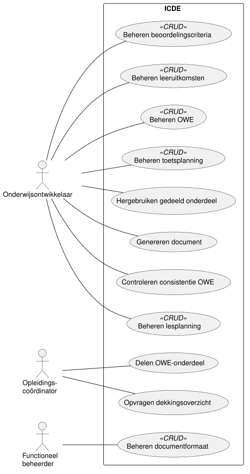

# Use cases ICDE

Dit document toont het use case diagram van ICDE en licht de keuzes toe.
Het bouwt voort op de actoren en de scope in [systeemgrenzen.md](systeemgrenzen.md).
De uitwerking van de belangrijkste use cases volgt in #3.

## Use case diagram

De bron is [diagrams/use-case-diagram.puml](diagrams/use-case-diagram.puml).

## Use cases

We vonden de use cases per primary actor, vanuit de doelen van die actor.
Elke use case is een elementair bedrijfsproces: één persoon voert het uit op één plaats en één
moment, en de gegevens zijn daarna consistent.

| ID | Use case | Primary actor | CRUD | Prioriteit |
| --- | --- | --- | --- | --- |
| UC01 | Beheren OWE | Onderwijsontwikkelaar | ja | hoog |
| UC02 | Beheren leeruitkomsten | Onderwijsontwikkelaar | ja | hoog |
| UC03 | Beheren beoordelingscriteria | Onderwijsontwikkelaar | ja | hoog |
| UC04 | Beheren lesplanning | Onderwijsontwikkelaar | ja | hoog |
| UC05 | Controleren consistentie OWE | Onderwijsontwikkelaar | nee | hoog |
| UC06 | Genereren document | Onderwijsontwikkelaar | nee | hoog |
| UC07 | Hergebruiken gedeeld onderdeel | Onderwijsontwikkelaar | nee | middel |
| UC08 | Opvragen dekkingsoverzicht | Opleidingscoördinator | nee | hoog |
| UC09 | Delen OWE-onderdeel | Opleidingscoördinator | nee | middel |
| UC10 | Beheren documentformaat | Functioneel beheerder | ja | middel |
| UC11 | Beheren toetsplanning | Onderwijsontwikkelaar | ja | hoog |

Het doel van elke use case:

- UC01 Beheren OWE: een onderwijseenheid aanmaken, bekijken, wijzigen en verwijderen.
- UC02 Beheren leeruitkomsten: de leeruitkomsten van een OWE vastleggen.
- UC03 Beheren beoordelingscriteria: beoordelingsdimensies, criteria en niveaus (de rubric) van
  een OWE vastleggen.
- UC04 Beheren lesplanning: lessen vastleggen en per les aangeven aan welke beoordelingscriteria
  die bijdraagt.
- UC05 Controleren consistentie OWE: het systeem meldt inconsistenties.
  Voorbeelden: een beoordelingsdimensie zonder onderwijs, of een les die niet bijdraagt aan een
  leeruitkomst.
- UC06 Genereren document: het systeem maakt uit de gegevens van een OWE een document in een
  gekozen formaat.
  Soorten documenten zijn de OWE-beschrijving, de EVL-beschrijving, de toetsplanning en het
  beoordelingsformulier.
- UC07 Hergebruiken gedeeld onderdeel: een ontwikkelaar neemt een gedeeld onderdeel op in de eigen
  OWE.
- UC08 Opvragen dekkingsoverzicht: het systeem toont per leeruitkomst van een opleiding in welke
  OWE's en lessen die aan bod komt.
- UC09 Delen OWE-onderdeel: een onderdeel van een OWE beschikbaar maken voor andere opleidingen of
  profielen.
- UC10 Beheren documentformaat: sjablonen voor documenten vastleggen, los van de inhoud.
- UC11 Beheren toetsplanning: toetsmomenten vastleggen, met een startweek, een deadlineweek en de
  beoordelingscriteria die ze beoordelen.
  Het systeem waarschuwt als er meer dan 3 toetsen in een week lopen.

## Eis: maximaal 65% CRUD

De casus eist minimaal 10 use cases, waarvan maximaal 65% CRUD.
Het diagram heeft 11 use cases.
Daarvan zijn er 6 CRUD: UC01, UC02, UC03, UC04, UC10 en UC11.
Dat is 55%.

## Keuzes

- Stereotype «CRUD».
  Voor het beheren van een item tekenen we één use case met «CRUD», zoals de cursus voorschrijft
  (CRUD Use Cases).
  Het stereotype is een verkorte weergave van toevoegen, bekijken, wijzigen en verwijderen.
  Het blijft één use case, ook bij de telling van 65% CRUD.
  We werken ze in #3 uit volgens het CRUD-sjabloon van de cursus.
- Geen «include» of «extend».
  Die geven in dit diagram geen meerwaarde.
- Geen use case Inloggen.
  Inloggen levert zelf geen waarde voor de gebruiker, en is dus geen elementair bedrijfsproces.
  Een ingelogde gebruiker is een preconditie van elke use case.
  Daarom staat de HAN-inlogdienst niet in het diagram.
- Geen use case voor samenwerken zonder versieconflicten.
  Dit is een eigenschap van alle wijzig-use cases, geen apart doel van een actor.
  We leggen het vast als niet-functionele requirement.
- Prioriteit.
  Hoog zijn de use cases die de kern van de casus vormen: gegevens vastleggen, controleren en
  documenten genereren.
  Middel zijn delen, hergebruiken en het beheer van formaten.
- Een klein diagram.
  De casus eist minimaal 10 use cases.
  We nemen er 11 op, zodat de analyse en het ontwerp gericht blijven.

## Buiten het diagram

Deze kandidaat-use cases hebben prioriteit laag, omdat ze afhangen van open vragen of van
koppelingen voor later.
Ze staan niet in het diagram.

- Vastleggen tussentijdse beoordeling en Bekijken groeioverzicht, voor Iterative Grading.
  Actor: docent.
  Dit hangt af van open vraag 2: legt de docent beoordelingen vast in ICDE?
- Publiceren OWE-beschrijving in OnderwijsOnline.
- Doorzetten eindbeoordeling naar Alluris.
  Deze twee koppelingen noemt de casus voor de lange termijn (open vraag 4).

Daarom staan de docent, OnderwijsOnline en Alluris uit
[systeemgrenzen.md](systeemgrenzen.md#actoren) niet in het diagram.
Beantwoordt de opdrachtgever de open vragen anders, dan komen deze use cases terug.
Is de student een directe gebruiker (open vraag 1), dan krijgt de student een eigen use case.
